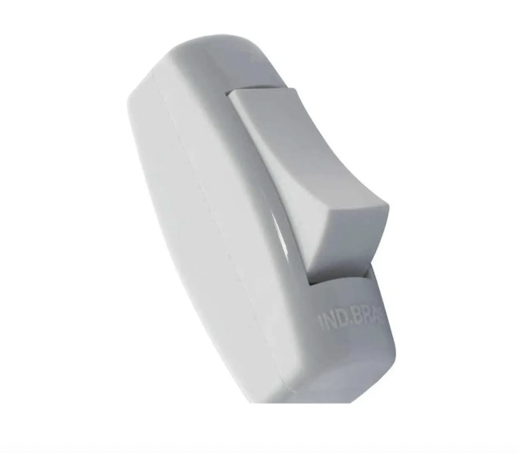

# Guia de Aula Prática: Montagem do Quadro de Chamadas de Enfermagem

## 🎓 Objetivo da Aula

Capacitar os alunos do **2º ano do Curso de Eletrotécnica** na montagem de um **Quadro de Chamadas de Enfermagem**, a ser instalado na parede externa do **Box 4** do Laboratório de Instalações Prediais.

## 📚 Descrição da Atividade

Cada box terá:
- Um **interruptor tipo pera** para acionar o chamado.

- Uma **arandela vermelha** para sinalizar a solicitação de presença de um profissional de enfermagem.

O quadro central controlará as chamadas via **ESP32**, com registro e monitoramento através de uma **interface web**.

## 🛠️ Materiais Necessários

| Quantidade | Componente                        | Descrição                                 |
|------------|-----------------------------------|---------------------------------------------|
| 1          | Quadro de Camada de Enfermagem    | Microcontrolador e dispositivos eletronicos internos                 |
| 4          | Interruptor tipo pera             | Acionadores de chamada                     |
| 4          | Arandelas vermelhas (127V)  | Indicadores de chamada                     |
| 1          | Fonte 127V  | Fonte de alimentação para o Quadro de chamadas   |
| Cabos      | Fios para conexões                | Ligação dos dispositivos                  |

## 📊 Esquema de Conexão

- **Interruptores tipo pera** conectados às **entradas digitais** do Quadro onde está o ESP32.
- **Arandelas** conectadas a sídas dos **relés**, acionados pelas **saídas digitais** do ESP32.
- **Quadro de Chamadas de Enfermagem** alimentado em rede de 127V

  

## 🔧 Procedimento de Montagem

## 📊 Atividades Propostas
- Realizar a montagem elétrica e mecânica dos equipamentos.
- 
### 1. Ligação dos Interruptores
- Fixar o interruptor tipo pera em local acessível dentro de cada Box Didático
- Conectar uma extremidade do UTP e a outra a uma entrada no painel do ESP32 através do cabo UTP já instalado.

### 2. Ligação das Arandelas
- Instalar a arandela vermelha acima da porta dos Boxes 1 a 4.
- Conectar uma extremidade do cabo à arandela e a outra a uma entrada no painel do ESP32 através do cabo 1mm2 já instalado.

### 3. Instalação do Quadro de Chamadas
- Montar todo o circuito na base (painel) conectando os condutores conforme esquema que segue.

### 4. Testes Finais
- Acionar cada interruptor e verificar se a respectiva arandela acende.
- Acessar o wifi do Laboratório e monitorar o funcionamento do sistema pelo navegador de seu celular.Testar os comandos da interface web para monitorar os estados.

