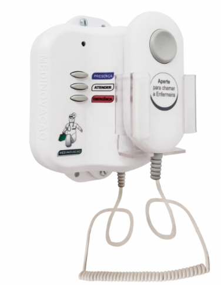

# Projeto: Quadro Sinalizador de Chamadas de Enfermagem

## 📢 O que é um sistema de chamada de enfermagem?

É um sistema que permite aos pacientes sinalizar a necessidade de assistência por parte da equipe de enfermagem, geralmente em ambientes hospitalares ou casas de repouso. Ele utiliza sinais sonoros e luminosos para alertar os profissionais de saúde sobre a necessidade de atendimento. 

Esse sinal é enviado para uma **central de monitoramento** 🛋️, localizada em local visível a todos os profissionais.

Além disso, o sistema permite que os profissionais de saúde **registrem a sua presença no leito** do paciente que gerou a chamada, sinalizando ao restante da equipe que o **atendimento está em andamento**.

## 🔧 Como funciona um sistema de chamada de enfermagem?

O paciente aciona a estação de chamada. 

O sinaleiro de porta acende, sinalizando a chamada externamente. 
A central do posto de enfermagem é acionada, indicando o número do leito ou do banheiro que solicitou ajuda. 
O profissional de enfermagem aciona o botão de presença para indicar que está atendendo à chamada. 
Após o atendimento, o profissional aciona novamente o botão de presença para desligar a chamada. 

Benefícios:

    Melhora a comunicação entre pacientes e equipe de enfermagem. 

Agiliza o atendimento, reduzindo o tempo de espera dos pacientes. 
Aumenta a segurança dos pacientes, permitindo que eles solicitem ajuda rapidamente em caso de necessidade. 
Permite que a equipe de enfermagem monitore a atividade e a demanda de atendimento em tempo real. 

Um **sistema de chamada de enfermagem** é composto por diferentes dispositivos, adaptados às necessidades do ambiente hospitalar:

### 🛉 Estação de Chamada de Enfermagem

Dispositivos fixados na parede ou painéis de gases medicinais, acessíveis por um **cordão com pera sensível ao toque 🌟**.

### 🔦 Sinaleiro de Porta

Indicadores visuais fixados **acima das portas** para alertar sobre chamadas em andamento, utilizando diferentes **cores 🟥**.

### 🛋️ Central do Posto de Enfermagem

Dispositivo centralizado que **monitora e sinaliza** todas as chamadas ativas.

---

## Aula Prática

[Guia de Aula Prática de Montagem](https://github.com/Epaminondaslage/quadro_de_chamadas/blob/main/Guia_de_Aula_Pr%C3%A1tica.md)

---

---

