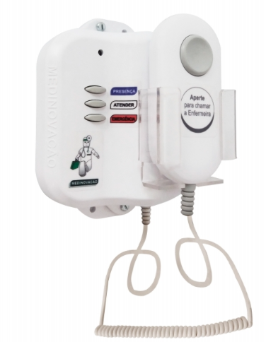
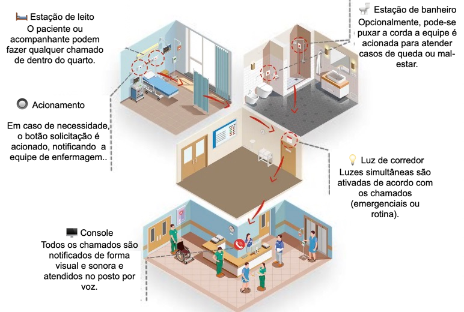

<td style="width: 10%;">
    
</td>

## **CENTRO FEDERAL DE EDUCAÇÃO TECNOLÓGICA DE MINAS GERAIS**  
## **Departamento de Engenharia Elétrica - CEFET-MG**  
## **Coordenação do Curso de Eletrotécnica**  

## Disciplina: **PLIP - Prática de Laboratório de Instalações Prediais**
## Guia de Aula – Quadro Sinalizador de Chamadas de Enfermagem

##  O que é um sistema de chamada de enfermagem?

É um sistema que permite aos pacientes sinalizar a necessidade de assistência por parte da equipe de enfermagem, geralmente em ambientes hospitalares ou casas de repouso. Ele utiliza sinais sonoros e luminosos para alertar os profissionais de saúde sobre a necessidade de atendimento. 

Esse sinal é enviado para uma **central de monitoramento** 🛋️, localizada em local visível a todos os profissionais. Veja na imagem que segue um modelo comercial empregado em hospitais e clinicas.

  

Além disso, o sistema permite que os profissionais de saúde **registrem a sua presença no leito** do paciente que gerou a chamada, sinalizando ao restante da equipe que o **atendimento está em andamento**.

## 🔧 Como funciona um sistema de chamada de enfermagem?

O paciente aciona a estação de chamada. 

O sinaleiro de porta acende, sinalizando a chamada externamente. 
A central do posto de enfermagem é acionada, indicando o número do leito ou do banheiro que solicitou ajuda. 
O profissional de enfermagem aciona o botão de presença para indicar que está atendendo à chamada. 
Após o atendimento, o profissional aciona novamente o botão de presença para desligar a chamada. 

  

Benefícios:

    Melhora a comunicação entre pacientes e equipe de enfermagem. 

Agiliza o atendimento, reduzindo o tempo de espera dos pacientes. 
Aumenta a segurança dos pacientes, permitindo que eles solicitem ajuda rapidamente em caso de necessidade. 
Permite que a equipe de enfermagem monitore a atividade e a demanda de atendimento em tempo real. 

Um **sistema de chamada de enfermagem** é composto por diferentes dispositivos, adaptados às necessidades do ambiente hospitalar:

### 🛉 Estação de Chamada de Enfermagem

Dispositivos fixados na parede ou painéis de gases medicinais, acessíveis por um **cordão com pera sensível ao toque 🌟**.

### 🔦 Sinaleiro de Porta

Indicadores visuais fixados **acima das portas** para alertar sobre chamadas em andamento, utilizando diferentes **cores 🟥**.

### 🛋️ Central do Posto de Enfermagem

Dispositivo centralizado que **monitora e sinaliza** todas as chamadas ativas.

---

## Guia de Aula Prática: Montagem do Quadro de Chamadas

Com o objetivo de **capacitar os alunos do 2º ano do Curso de Eletrotécnica**, esta aula prática propõe a montagem de um **Quadro de Chamadas de Enfermagem**, que será instalado na parede externa do **Box 4** do Laboratório de Instalações Prediais.

Durante a atividade, os alunos aplicarão conceitos de eletrônica, comandos elétricos e automação, utilizando botões tipo pera, arandelas de sinalização e um sistema de controle baseado em microcontrolador **ESP32** com interface web.

➡️ Para detalhes completos do procedimento e materiais necessários, acesse o [Guia de Aula Prática de Montagem](https://github.com/Epaminondaslage/quadro_de_chamadas/blob/main/Guia_de_Aula_Pr%C3%A1tica.md).

---
## Retrofit do Quadro de Chamadas de Enfermagem

### O que é Retrofit?

**Retrofit** é o processo de **modernização e aprimoramento de sistemas, equipamentos ou estruturas já existentes**, visando **aumentar sua eficiência, funcionalidade e segurança**, ao mesmo tempo em que os adapta às **novas tecnologias**.  Em vez de substituir totalmente o que já foi construído, o retrofit promove uma **renovação inteligente**, aproveitando a infraestrutura física disponível e incorporando melhorias técnicas capazes de atender às exigências contemporâneas de desempenho e inovação.

➡️ Para detalhes completos do procedimento de retrofit veja : [Retrofit do Quadro de Chamadas de Enfermagem](https://github.com/Epaminondaslage/quadro_de_chamadas/blob/main/%F0%9F%94%A7%20Retrofit-do-Quadro-de-Chamadas.md).

---
## Projeto de um Quadro de Chamadas de Enfermagem Didático

O **Quadro de Chamadas** foi desenvolvido por professores do **CEFET-MG** com fins didáticos, com o objetivo de proporcionar aos alunos uma experiência prática em sistemas de automação e monitoramento. Utilizando o microcontrolador **ESP32**, o projeto simula um sistema real de chamadas de enfermagem, integrando entradas digitais (botões tipo pera) e saídas visuais (arandelas vermelhas) acionadas por relés. Além disso, inclui uma interface web para acompanhamento em tempo real das solicitações, reforçando conceitos de eletrônica, redes de comunicação e programação embarcada.

➡️ Para mais detalhes, consulte: [Projeto Quadro de Chamadas ESP32](https://github.com/Epaminondaslage/quadro_de_chamadas/blob/main/Projeto_Quadro_de_Chamadas_ESP32.md)

---

